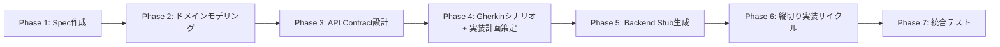
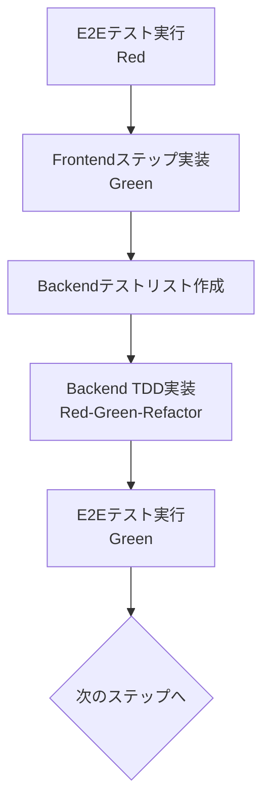
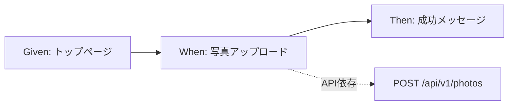

# AI協働開発手法

このドキュメントでは、HatoMask Appプロジェクトにおける**AI協働開発の思想、原則、プロセス**を解説します。

## 目次

- [思想（Philosophy）](#思想philosophy)
- [原則（Principles）](#原則principles)
- [開発プロセス（Process）](#開発プロセスprocess)
- [実践（Practice）](#実践practice)

---

## 思想（Philosophy）

### AIを開発プロセスの協働パートナーとして位置づける

このプロジェクトでは、AIを単なる「コード生成ツール」として扱うのではなく、**構造化された開発プロセスの一部**として統合しています。

#### 1. ドキュメント駆動 × AI協働

**何をするか**:

仕様書→ドメインモデル→API仕様→実装という順序で、段階的にドキュメントを作成しながら開発を進めます。

```
Spec → ドメインモデル → API Contract → 実装計画 → 実装 → テスト → 統合
```

AIには以下の2種類のプロンプトで知識を共有します：
- **システムプロンプト**: プロジェクトの共通ルール（役割、ワークフロー、品質基準）
- **タスクプロンプト**: 各作業の具体的な手順（テンプレート化されたPhase 1-7の手順）

**メリット**:
- **手戻りが少ない**: 仕様が明確になってから実装するため、認識齟齬による修正が減る
- **効率的な協働**: AIに毎回同じ説明をする必要がなく、プロンプトで一貫した品質を維持
- **理解しやすい**: 開発の過程がドキュメントとして記録されるため、後から参加するメンバーもキャッチアップしやすい
- **同期が取れる**: 実装前に仕様を確定し、実装後にテストで検証することで、ドキュメントとコードの乖離を防止

#### 2. 段階的アプローチ（1ステップずつ確実に）

**何をするか**:

「1ステップ1プロンプト」の原則に従い、AIには一度に1つのことだけを依頼します。AIに全体を投げず、現在実装すべき1ステップのみを指示します。

テスト駆動開発（TDD）の以下のサイクルを厳守します：
- **Red（失敗）**: まずテストを書き、失敗することを確認
- **Green（成功）**: 最小限の実装でテストを通す
- **Refactor（改善）**: コードを整理し、品質を向上

**制約**:
- **先読み実装の禁止**: AIが勝手に後続ステップを実装することを明示的に禁止
- **各ステップでの確認**: Red/Greenを確認してから次へ進む

**メリット**:
- **問題の特定が容易**: 問題が起きてもどこで発生したか特定しやすい
- **AIの暴走防止**: AIが勝手に先回りして余計なコードを書くことを防げる
- **品質の確保**: 小さな成功を積み重ねることで、着実に品質を確保できる
- **早期フィードバック**: 各ステップで動作確認し、問題を早期発見

#### 3. 縦切り開発（小さな単位で完結させる）

**何をするか**:

「フロントエンドを全部作ってからバックエンド」という水平分割ではなく、小さな実装単位でUI→API→ビジネスロジック→データベースまで一気通貫で動くようにしてから、次の単位に進みます。

**実装の進め方**:
- **小さな単位**: 例えば「ログインボタンを押す」という1つの操作レベル
- **一気通貫**: その操作に必要なフロント→バック→DBまでを1セットで実装
- **API Contract First**: OpenAPI仕様を中立な契約として先に確立し、フロント/バックの齟齬を防止
- **柔軟な実装粒度**: ステップ単位/APIグループ単位/シナリオ単位をAIが分析し、人間が決定

**メリット**:
- **早期の動作確認**: 小さく動くものを積み重ねるため、早い段階で動作確認できる
- **連携ミスの早期発見**: フロントとバックの連携ミスを早期に発見できる
- **影響範囲の最小化**: 問題が起きても影響範囲が小さいので、修正しやすい
- **価値の早期提供**: 各スライスが独立して動作可能な機能を提供

---

## 原則（Principles）

### AI制御のための設計原則

#### 1. 明示的な制約

AIの「暴走」を防ぐため、以下の制約を明示的に設定しています：

- **先読み実装の禁止**: 指示されていないステップを実装しない
- **1プロンプト1ステップ**: 複数のステップを同時に指示しない
- **テストファースト**: 実装前に必ずテストを書く
- **規約遵守**: コーディング規約を自己チェックし、違反を防止

#### 2. 思考プロセスの明示化

複雑な判断が必要な場合、AIは以下の形式で思考を共有します：

```markdown
### 検討事項
- 考慮すべきポイント1
- 考慮すべきポイント2

### 選択肢
1. 選択肢A: メリット・デメリット
2. 選択肢B: メリット・デメリット

### 推奨
選択肢Aを推奨。理由：...
```

#### 3. 人間とAIの役割分担

| 役割 | 人間 | AI |
|------|------|-----|
| **意思決定** | 実装粒度の選択、リスク判断、アーキテクチャ決定 | - |
| **分析・提案** | - | 依存関係分析、実装計画策定、テストケース生成 |
| **実装** | レビュー、承認 | コード生成、テスト実装 |
| **検証** | 最終確認、受け入れテスト | ユニットテスト、静的解析 |

---

## 開発プロセス（Process）

### 7段階の開発フロー

このプロジェクトでは、以下の7つのPhaseで開発を進めます。



#### Phase 1: Spec作成（要件定義）

- **目的**: 機能の受け入れ基準を明確化
- **成果物**: `docs/spec/features/XX_feature_name.md`
- **記述形式**: Given-When-Then形式（BDD）

#### Phase 2: ドメインモデリング（初稿）

- **目的**: ビジネスロジックの概念を整理
- **成果物**: `docs/spec/models/XX_domain_model.md`
- **内容**: Entity, ValueObject, Repository Interface
- **AIタスク**: `docs/ai/prompts/tasks/02_simple_modeling.md`

#### Phase 3: API Contract設計 + モデル見直し

- **目的**: フロント/バック間の契約を確立
- **成果物**: `docs/spec/api/XX_api_name.yaml`（OpenAPI仕様）
- **特徴**: Phase 2で作成したドメインモデルを見直し、1往復で概念を揃える
- **AIタスク**: `docs/ai/prompts/tasks/03_design_api_contract.md`

#### Phase 4: Gherkinシナリオ + 実装計画策定

- **目的**: E2Eテストシナリオと実装計画を作成
- **成果物**:
  - `e2e/features/XX_feature_name.feature`（Gherkinシナリオ）
  - `docs/plans/XX_implementation_plan.md`（実装計画）
- **実装計画の内容**:
  - 各Gherkinステップの実装分類（API依存/状態依存/フロントのみ）
  - 推奨グルーピング（APIグループ単位の提案）
  - ステップ間の依存関係分析（Mermaid図）
- **AIタスク**: `docs/ai/prompts/tasks/01_create_feature_spec.md`, `04_plan_implementation.md`

#### Phase 5: Backend Stub生成

- **目的**: フロント実装前にバックエンドに固定データを返すStubを生成
- **成果物**: `src/backend/src/main/java/.../StubController.java`
- **利点**: フロントが早期に統合テスト可能、API Contractの検証が容易
- **AIタスク**: `docs/ai/prompts/tasks/05_generate_stubs.md`

#### Phase 6: 縦切り実装サイクル

**Outside-In TDD（E2E → Frontend → Backend）** を採用し、1機能単位でUI→API→ドメイン→DBまで貫通します。



**サブサイクル**:

1. **E2Eテスト実行（Red）**: Gherkinシナリオを実行し、失敗を確認
2. **Frontendステップ実装（Green）**: UI/API呼び出しを実装（Stubに接続）
3. **Backendテストリスト作成**: ドメイン層/API層のテストケースを計画
4. **Backend TDD実装（Red-Green-Refactor）**:
   - ドメイン層: Entity → Repository → UseCase
   - API層: Controller（Stubを本実装に置き換え）
5. **E2Eテスト実行（Green）**: 実装完了を確認

**AIタスク**: `docs/ai/prompts/tasks/06_vertical_slice_implementation.md`

#### Phase 7: 統合テスト

- **目的**: 全機能の統合動作を確認
- **実行内容**: E2Eテストスイート全体の実行、パフォーマンステスト、セキュリティテスト

---

## 実践（Practice）

### AI制御のプロトコル

#### 1. 実装粒度の相談プロトコル

AIは実装開始前に、以下の3パターンを提案します：

| パターン | 粒度 | メリット | デメリット |
|---------|------|---------|-----------|
| **ステップ単位** | 最小差分 | 問題の早期発見、Red-Green高速サイクル | 実装回数が多く、時間がかかる |
| **APIグループ単位**（推奨） | 中程度 | バランスが良い、API境界で自然に分割 | 依存関係の把握が必要 |
| **シナリオ単位** | 大規模 | 実装回数が少ない | 問題の発見が遅れる、Red期間が長い |

**決定**: 人間が選択（通常はAPIグループ単位を推奨）

#### 2. テストリスト駆動TDD

実装前にテストケースをMarkdownファイルで計画します：

**例**: `testlists/domain/photo_upload.md`

```markdown
# Photo Uploadドメイン層 テストリスト

## Entity: Photo
- [ ] 正常系: 有効なファイル名とMIMEタイプでPhotoエンティティを作成できる
- [ ] 異常系: ファイル名がnullの場合、IllegalArgumentExceptionをスローする
- [ ] 異常系: サポートされていないMIMEタイプの場合、例外をスローする

## Repository: PhotoRepository
- [ ] 正常系: Photoエンティティを保存できる
- [ ] 正常系: IDでPhotoエンティティを取得できる
- [ ] 異常系: 存在しないIDで取得すると、空のOptionalを返す
```

**カバレッジ目標**:
- 全体: 80%以上
- 重要ロジック: 90%以上
- ユーティリティ: 100%

#### 3. Backend Stub戦略

**Stubの役割**:
- OpenAPI仕様と完全一致するレスポンスを返す
- フロント実装時に実際のバックエンドとして機能
- API依存ステップの実装時に本実装に段階的に置き換え

**例**:

```java
@RestController
@RequestMapping("/api/v1/photos")
public class PhotoStubController {
    
    @PostMapping(consumes = MediaType.MULTIPART_FORM_DATA_VALUE)
    public ResponseEntity<ApiResponse<PhotoUploadResponse>> uploadPhoto(
            @RequestParam("file") MultipartFile file) {
        // Stub: 固定データを返す
        PhotoUploadResponse response = new PhotoUploadResponse(
            "stub-photo-id-12345",
            "example.jpg",
            Instant.now()
        );
        return ResponseEntity.ok(ApiResponse.success(response));
    }
}
```

#### 4. 依存関係分析

AIは各Gherkinステップの依存関係を以下のように分類します：

```markdown
| ステップ | 分類 | API依存 | 状態依存 | 備考 |
|---------|------|---------|---------|------|
| Given ユーザーがトップページにアクセスする | フロントのみ | なし | なし | ルーティングのみ |
| When ユーザーが写真をアップロードする | API依存 | POST /api/v1/photos | なし | バックエンド実装必要 |
| Then アップロード成功メッセージが表示される | 状態依存 | なし | 前ステップの結果 | フロント状態管理 |
```

**Mermaid図による可視化**:



---

## まとめ

HatoMask AppプロジェクトのAI協働開発は、以下の特徴を持ちます：

1. **ドキュメント駆動**: 仕様→モデル→API→実装の段階的進化
2. **段階的アプローチ**: 1ステップ1プロンプト、Red-Green-Refactor、先読み実装禁止
3. **縦切り開発**: 1機能単位でUI→API→ドメイン→DBまで貫通
4. **明示的な制約**: AIの暴走を防ぐプロトコル設計
5. **人間とAIの役割分担**: 意思決定は人間、分析・実装はAI

このアプローチにより、AIとの協働で**再現可能**かつ**高品質**なソフトウェア開発を実現しています。

---

## 関連ドキュメント

- [開発ガイド](./dev/DEVELOPMENT.md) - TDD開発フロー、テスト実行方法
- [コーディング規約](./dev/CODING_STANDARDS.md) - 命名規則、設計原則
- [品質基準](./dev/QUALITY_STANDARDS.md) - 品質基準とベストプラクティス
- [AIプロンプト集](./ai/prompts/tasks/) - タスク別指示テンプレート
- [システムプロンプト](./ai/prompts/system/) - AIの基本動作定義
