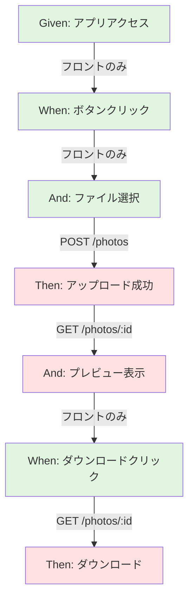
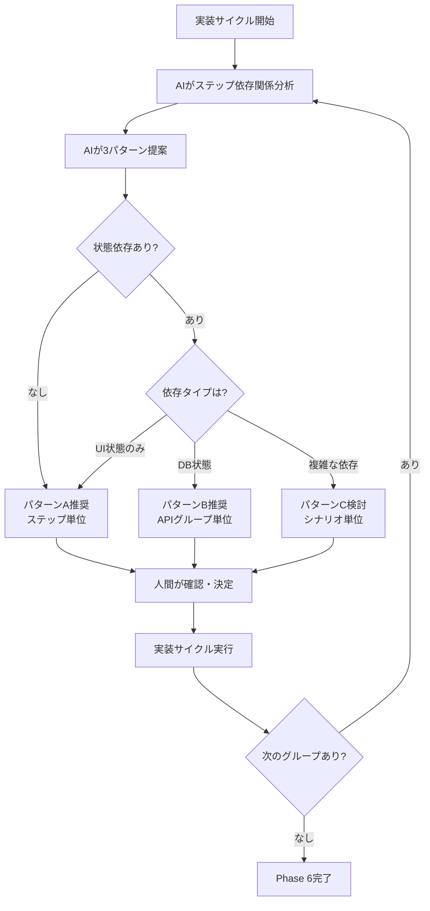

# 縦切り実装戦略ガイド

このドキュメントは、Phase 6「縦切り実装サイクル」における実装粒度の決定方法と、AIとの相談プロトコルを定義します。

## 基本方針

### API依存ステップのみバックエンド実装

- **フロントのみステップ**: 初期状態設定など、API呼び出しを含まないステップ
- **API依存ステップ**: バックエンドAPIを呼び出すステップ（フロント+バックエンド両方実装）

### 柔軟な実装粒度

実装粒度は状況に応じて選択：

1. **ステップ単位**: 最小差分、最速フィードバック
2. **APIグループ単位**: 関連ステップをまとめて実装
3. **シナリオ単位**: 従来型の一括実装

## 実装粒度相談プロトコル

### AIの責務

各実装サイクル開始前に、AIは以下を分析・提案する：

#### 1. ステップ依存関係分析

各Gherkinステップについて：

- **API依存**: 呼び出すエンドポイント（例: `POST /api/v1/photos`）
- **状態依存**: 前ステップのDB状態に依存するか
- **フロントのみ**: API不要で完結するか

**出力例（Mermaid図）**:



**凡例**:
- 🟢 緑: フロントのみ
- 🔴 赤: API依存（バックエンド実装必要）

#### 2. 実装粒度提案

**作成ファイル**: `docs/plans/[Spec名]_[シナリオ識別子]_granularity.md`

以下を記載：
- **選択パターン**: A/B/Cから最適なものを選択
- **選択理由**: なぜそのパターンを選んだか
- **実装グルーピング**: 具体的なグループ分け
- **実装上の注意点**: E2E状態依存、Stub判断、テストデータ準備方針

**3つのパターン**:

| パターン | 粒度 | メリット | デメリット | 推奨度 |
|---------|------|---------|-----------|--------|
| A | ステップ単位 | 差分最小、素早いフィードバック | 状態分断リスク、頻繁な切り替え | ⭐⭐ |
| B | APIグループ単位 | 状態連続性確保、適度な粒度 | やや差分大きい | ⭐⭐⭐ |
| C | シナリオ単位 | 従来型、手戻り少ない | 差分大、フィードバック遅い | ⭐ |

**通常はパターンB（APIグループ単位）を推奨**:
- POST→GETなど状態依存のあるステップをまとめて実装
- 1サイクル2-5ステップ程度で適度な粒度
- E2Eテストが自然な流れで実行できる

**主要な判断基準**:
- **E2E状態依存**: POST→GETなどDB状態に依存する場合はグループ化
- **Stub継続判断**: 他シナリオで再利用するか、実装の複雑さで判断
- **テストデータ準備**: グループ化すれば自然にデータが作成される

### 人間の責務

AIの提案を確認し、以下を決定：

1. **実装粒度の選択**: パターンA/B/Cのいずれか
2. **調整指示**: 必要に応じてグルーピングをカスタマイズ
3. **実装開始承認**: 決定した粒度で実装サイクル開始

**決定例**:
```
「パターンBで進めてください。ただし、グループ2はステップ4-6まで含めてください」
```

## 実装サイクル詳細

### フロントのみステップ

```
1. Step Definition作成（e2e/step-definitions/）
   → Red確認
2. Unit Test作成（必要な場合）
   → Red確認
3. Implementation（src/frontend/）
   → Green確認
4. Refactor
5. E2E実行（バックエンドStub接続）
   → このステップまで通過確認
```

### API依存ステップ（推奨フロー）

```
【フェーズ1: フロント実装】
1. Step Definition作成
2. Unit Test作成
3. Implementation
4. E2E実行（バックエンドStub接続）
   → Green確認

【フェーズ2: バックエンド実装】
6. ドメイン層TDD
   - Entity/ValueObject
   - Repository Interface + 実装
   - DomainService（必要な場合）
7. アプリケーション層TDD
   - UseCase
8. プレゼンテーション層TDD
   - Controller（Stub置き換え、TODOコメント削除）
   - DTO

【フェーズ3: 統合確認】
9. E2E実行（実装済みバックエンド）
    → 該当ステップまで通過確認
10. レスポンス形式確認
    → OpenAPI仕様と完全一致を検証
```

## 状態管理の考慮事項

### 状態依存の種類

#### 1. DB状態依存

前ステップで作成したリソースを後続ステップで使用：

```gherkin
When ユーザーが1枚目のJPEGファイルをアップロードする  # POST /photos → id: abc-123
Then 1枚目の画像がプレビューエリアに表示される        # GET /photos/abc-123
```

**対策**:
- APIグループ単位でまとめて実装
- または `@BeforeEach` でテストデータ準備

#### 2. UI状態依存

フロントエンドのステート（React State等）に依存：

```gherkin
When ユーザーが「写真を選択」ボタンをクリックする
And ユーザーがファイルを選択する                   # State: selectedFile
Then プレビューエリアに選択した画像が表示される    # State: previewUrl
```

**対策**:
- フロントのみステップとしてまとめて実装
- Step Definition内でstateを引き継ぐ

#### 3. 独立ステップ

前後のステップと状態依存がない：

```gherkin
Given ユーザーがHatoMaskアプリケーションにアクセスしている
```

**対策**:
- 単独で実装可能
- ステップ単位実装でも問題なし

### 状態分断リスクの判定

AIが以下の基準で判定：

| 状態依存 | リスク | 推奨粒度 |
|---------|-------|---------|
| なし | 低 | ステップ単位可 |
| UI状態のみ | 低 | ステップ単位可（同一画面内） |
| DB状態（同一API） | 中 | APIグループ推奨 |
| DB状態（異なるAPI） | 高 | APIグループ必須 |

## 実装粒度決定のフローチャート



## 実装例

### シナリオ: JPEGファイルのアップロードとダウンロード

```gherkin
Given ユーザーがHatoMaskアプリケーションにアクセスしている
When ユーザーが「写真を選択」ボタンをクリックする
And ユーザーがファイルサイズ5MBのJPEGファイルを選択する
Then アップロードが成功する
And プレビューエリアに選択した画像が表示される
When ユーザーが「ダウンロード」ボタンをクリックする
Then 元の画像がダウンロードされる
```

### AIの分析結果

**依存関係**:
```
ステップ1 (Given): フロントのみ
ステップ2 (When): フロントのみ
ステップ3 (And): フロントのみ
ステップ4 (Then): POST /api/v1/photos → DB状態作成
ステップ5 (And): GET /api/v1/photos/:id → ステップ4のDB状態依存
ステップ6 (When): フロントのみ
ステップ7 (Then): GET /api/v1/photos/:id → ステップ4のDB状態依存
```

**提案**:

| パターン | グルーピング | 推奨度 |
|---------|-------------|--------|
| A | 1, 2, 3, 4, 5, 6, 7（各個別） | ⭐ |
| B | [1-3], [4-5], [6-7] | ⭐⭐⭐ |
| C | [1-7] | ⭐⭐ |

**推奨: パターンB**

**理由**:
- ステップ4でPOST、ステップ5でGETするため、連続実装が効率的
- ステップ6-7も同様にGET依存があるが、既にPOST実装済みなので分離可能

### 実装スケジュール（パターンB採用）

**サイクル1: フロントのみ（ステップ1-3）**
```
1. Step Definition: Given, When, And
2. Implementation: App初期表示、ボタン、ファイル選択UI
3. E2E確認（バックエンドStub不要）
```

**サイクル2: アップロード〜プレビュー（ステップ4-5）**
```
フロント:
1. Step Definition: Then (アップロード成功), And (プレビュー)
2. Implementation: アップロード処理、プレビュー表示

バックエンド:
4. Domain: Photo Entity, PhotoRepository
5. UseCase: UploadPhotoUseCase, GetPhotoUseCase
6. Controller: POST /photos, GET /photos/:id（Stub置き換え）

統合:
7. E2E実行（実装済みバックエンド、ステップ1-5通過確認）
```

**サイクル3: ダウンロード（ステップ6-7）**
```
フロント:
1. Step Definition: When (ダウンロードクリック), Then (ダウンロード)
2. Implementation: ダウンロード処理

バックエンド:
3. UseCase: DownloadPhotoUseCase（GetPhotoを再利用）
4. Controller: レスポンスヘッダー調整

統合:
5. E2E実行（ステップ1-7全通過確認）
```

## まとめ

### 縦切り実装の成功ポイント

1. **Phase 3でのAPI Contract確立**: OpenAPI仕様が明確であること
2. **Phase 4での依存関係分析**: 事前にグルーピング案を準備
3. **Phase 5でのStub品質**: バックエンドStubがOpenAPIに忠実
4. **Phase 6でのAIとの相談**: 状況に応じた柔軟な粒度選択
5. **継続的な統合確認**: 各サイクル完了時にE2E実行

### 推奨デフォルト

特に理由がなければ**パターンB（APIグループ単位）**を選択。
状態依存が少ない場合はパターンA（ステップ単位）も検討。
