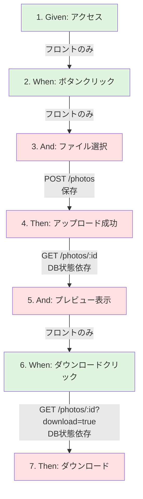

# ステップ依存関係分析: JPEGファイルのアップロードとダウンロード

## 基本情報
- **Feature**: 写真のアップロードとダウンロード
- **Scenario**: JPEGファイルのアップロードとダウンロード
- **実装計画**: [docs/plans/01_photo_upload_jpeg_download.md](01_photo_upload_jpeg_download.md)

## ステップ依存関係分析

| # | ステップ | 分類 | API | 状態依存 | 備考 |
|---|---------|------|-----|---------|------|
| 1 | Given: ユーザーがHatoMaskアプリケーションにアクセスしている | フロントのみ | - | なし | 初期表示 |
| 2 | When: ユーザーが「写真を選択」ボタンをクリックする | フロントのみ | - | なし | ファイル選択ダイアログ |
| 3 | And: ユーザーがファイルサイズ5MBのJPEGファイルを選択する | **API依存** | POST /api/v1/photos | UI状態 | 自動アップロード |
| 4 | Then: アップロードが成功する | **API依存** | POST /api/v1/photos | UI状態 | レスポンス検証 |
| 5 | And: プレビューエリアに選択した画像が表示される | **API依存** | GET /api/v1/photos/{id} | **DB状態** | ステップ3で保存したPhoto取得 |
| 6 | When: ユーザーが「ダウンロード」ボタンをクリックする | フロントのみ | - | UI状態 | ボタンクリック |
| 7 | Then: 元の画像がダウンロードされる | **API依存** | GET /api/v1/photos/{id}?download=true | **DB状態** | 同じPhotoをダウンロード用取得 |

### 分類基準

- **フロントのみ**: API呼び出しなし、UI操作のみ
- **API依存**: バックエンドAPIを呼び出す（フロント+バックエンド両方実装必要）
- **状態依存**:
  - **UI状態**: React State等のフロントエンド内部状態に依存
  - **DB状態**: 前ステップでDBに保存したデータに依存（E2E連続性に影響）

## 依存関係図

### 凡例
- 🟢 **緑（#e1f5e1）**: フロントのみ
- 🔴 **赤（#ffe1e1）**: API依存（バックエンド実装必要）

## 重要な依存関係

### DB状態依存の詳細

#### ステップ3-4 → ステップ5

**ステップ3-4**: POST /api/v1/photos
- DBにPhotoレコード作成（id: UUID自動生成）
- imageDataとメタデータを保存

**ステップ5**: GET /api/v1/photos/{id}
- ステップ3-4で作成したPhotoを取得
- imageDataを画像として表示

**E2Eテストへの影響**:
- パターンA（ステップ単位）: ステップ5実行前にPhotoレコードのセットアップが必要（テストデータ準備が複雑）
- **パターンB（APIグループ）**: ステップ3-4-5を連続実行するため、E2Eの流れが自然 ⭐ 推奨
- パターンC（シナリオ単位）: フロント完成後、バックエンド実装時に全体セットアップ

#### ステップ3-4 → ステップ7

**ステップ3-4**: POST /api/v1/photos
- 同じPhotoレコード（同じID）

**ステップ7**: GET /api/v1/photos/{id}?download=true
- ステップ3-4で作成したPhotoを再度取得
- Content-Dispositionヘッダー付きでダウンロード

**E2Eテストへの影響**:
- ステップ5と同様に、DB状態に依存
- ステップ5-6-7をグループ化することも可能だが、APIとしてはGET /photos/:idの拡張（クエリパラメータ追加）のみ

## API依存ステップの概要

### POST系（データ作成）

| ステップ | エンドポイント | 概要 | 後続の依存 |
|---------|---------------|------|-----------|
| 3-4: ファイル選択〜成功 | POST /api/v1/photos | 写真アップロード、Photo作成 | ステップ5, 7 |

### GET系（データ取得）

| ステップ | エンドポイント | 概要 | 前提条件 |
|---------|---------------|------|---------|
| 5: プレビュー表示 | GET /api/v1/photos/{id} | 画像バイナリ取得 | ステップ3-4でPhoto作成済み |
| 7: ダウンロード | GET /api/v1/photos/{id}?download=true | 画像ダウンロード（Content-Disposition付き） | ステップ3-4でPhoto作成済み |

## 補足

### ステップ3と4の関係

ステップ3「ファイル選択」とステップ4「アップロード成功」は、実装上は**同一のPOST /api/v1/photosリクエスト**です。

- ステップ3: ファイル選択→即座にアップロード実行
- ステップ4: レスポンスの検証（201 Created、PhotoResponseの存在確認）

**グルーピング戦略**:
- ステップ3と4は密接に関連しており、分離困難
- 実装時はステップ3-4を一体として扱う

### ステップ5と7の類似性

GET /api/v1/photos/{id} の呼び出しという点で類似していますが、以下の違いがあります:

- **ステップ5**: プレビュー表示（`download=false`、デフォルト）
- **ステップ7**: ダウンロード（`download=true`）

**グルーピング戦略**:
- ステップ5を含むグループでGET APIの基本実装を完了
- ステップ7ではdownloadパラメータ対応のみ追加（Controller調整程度）

### E2E連続性の重要性

このシナリオは「アップロード→プレビュー→ダウンロード」という連続フローです。**パターンB（APIグループ単位）**が最適な理由:

1. ステップ3-4-5をグループ化: アップロードとプレビューの一連の流れを保持
2. ステップ6-7を別グループ化可能: ダウンロードは追加機能的な位置付け
3. DB状態依存が自然に解決: セットアップ不要でE2Eテストが通過
