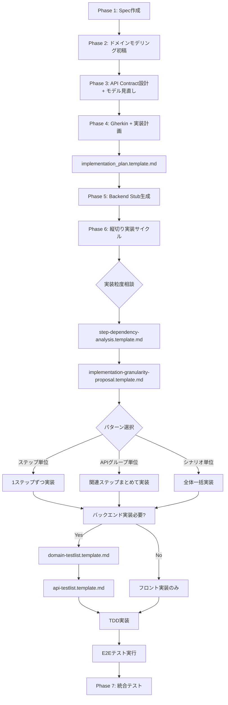

# 実装計画テンプレート

このディレクトリには、BDD/TDD 開発プロセスで使用する実装計画とテストリストのテンプレートが含まれています。

## 📋 テンプレート一覧

### 1. implementation_plan.template.md

**用途**: Phase 4 - Gherkin シナリオ作成 + 実装計画策定  
**内容**:

- OpenAPI 仕様の参照
- ステップ別実装分類（フロントのみ/API 依存/状態依存）
- 推奨実装グルーピング

**使用タイミング**: Gherkin シナリオ選択後、実装開始前  
**配置先**: `docs/plans/[Spec名]_[シナリオ識別子].md`

---

### 2. step-dependency-analysis.template.md

**用途**: Phase 6 - 縦切り実装粒度の決定支援  
**内容**:

- 各ステップの API 依存分析
- 状態依存の明確化（UI 状態/DB 状態）
- 依存関係図（Mermaid）

**使用タイミング**: 実装粒度を相談・決定する前  
**配置先**: `docs/plans/[Spec名]_[シナリオ識別子]_dependency.md`

---

### 3. implementation-granularity-proposal.template.md

**用途**: Phase 6 - 実装粒度パターンの選択・記録  
**内容**:

- 3 パターン比較（ステップ単位/API グループ単位/シナリオ単位）
- メリット・デメリット分析
- 選択理由の記録

**使用タイミング**: 依存関係分析後、実装開始前  
**配置先**: `docs/plans/[Spec名]_[シナリオ識別子]_granularity.md`

---

### 4. domain-testlist.template.md

**用途**: Phase 6 - バックエンドドメイン層の TDD 実装  
**対象**: Entity, Repository, DomainService

**使用タイミング**: 縦切り実装でバックエンド実装が必要な時  
**配置先**: `docs/plans/[Spec名]_[シナリオ識別子]_domain_testlist.md`

---

### 5. api-testlist.template.md

**用途**: Phase 6 - バックエンド API 層の TDD 実装  
**対象**: UseCase, Controller, DTO, 統合テスト

**使用タイミング**: ドメイン層実装完了後、API 層実装時  
**配置先**: `docs/plans/[Spec名]_[シナリオ識別子]_api_testlist.md`

---

## 🔄 開発フロー（新プロセス）



---

## 📖 使用方法

### Phase 4: 実装計画作成

```bash
# テンプレートをコピー
cp docs/plans/templates/implementation_plan.template.md \
   docs/plans/[Spec名]_[シナリオ識別子].md

# プレースホルダーを埋める
# - [Feature名], [シナリオ名]
# - OpenAPI仕様参照
# - ステップ別実装分類（フロントのみ/API依存）
```

### Phase 6: 実装粒度の相談

**Step 1: 依存関係分析**

```bash
cp docs/plans/templates/step-dependency-analysis.template.md \
   docs/plans/[Spec名]_[シナリオ識別子]_dependency.md

# 各ステップを分析:
# - API呼び出しの有無
# - 状態依存（UI状態/DB状態）
# - 依存関係図の作成
```

**Step 2: 実装粒度提案**

```bash
cp docs/plans/templates/implementation-granularity-proposal.template.md \
   docs/plans/[Spec名]_[シナリオ識別子]_granularity.md

# 3パターンを比較:
# - パターンA: ステップ単位
# - パターンB: APIグループ単位（推奨）
# - パターンC: シナリオ単位
#
# 選択理由を記録
```

**Step 3: バックエンド実装（API 依存ステップのみ）**

```bash
# ドメイン層テストリスト
cp docs/plans/templates/domain-testlist.template.md \
   docs/plans/[Spec名]_[シナリオ識別子]_domain_testlist.md

# API層テストリスト
cp docs/plans/templates/api-testlist.template.md \
   docs/plans/[Spec名]_[シナリオ識別子]_api_testlist.md

# TDDサイクルで実装:
# 1. Red: テストを書く（失敗する）
# 2. Green: 最小限の実装で通す
# 3. Refactor: リファクタリング
```

---

## 📁 ディレクトリ構成例

```
docs/plans/
  photo-upload-scenario1.md                    # Phase 4: 実装計画
  photo-upload-scenario1_dependency.md         # Phase 6: 依存関係分析
  photo-upload-scenario1_granularity.md        # Phase 6: 粒度選択
  photo-upload/
    backend-testlist/
      domain_photo_upload.md                   # ドメイン層TDD
      api_photo_upload.md                      # API層TDD
  photo-download-scenario1.md
  photo-download-scenario1_dependency.md
  photo-download-scenario1_granularity.md
  photo-download/
    backend-testlist/
      domain_photo_download.md
      api_photo_download.md
```

---

## ⚠️ 重要な注意事項

### API Contract First 開発

- **OpenAPI 仕様が契約**: フロント・バックエンド間の中立な契約
- **Phase 5 で Stub 生成**: フロントエンドは Stub に直接接続して開発開始
- **Phase 6 で本実装**: API 依存ステップのみバックエンド本実装

### 実装粒度の柔軟性

- **AI と相談して決定**: 依存関係分析 →3 パターン比較 → 選択
- **通常はパターン B 推奨**: API グループ単位（2-5 ステップ）
- **状態連続性を重視**: DB 状態依存があるステップはまとめる

### 縦切り実装の利点

- **差分が小さい**: レビュー容易、フィードバック早い
- **E2E 確認が早い**: 各サイクルで E2E テスト実行
- **手戻りが少ない**: API 契約が確定しているため

### ドメイン層と API 層の分離

- **ドメイン層**: ビジネスロジック、外部技術から独立
- **API 層**: HTTP インターフェース、OpenAPI 契約に準拠

---

## 🔗 関連ドキュメント

### 開発プロセス

- [開発プロセスガイド](../../dev/DEVELOPMENT.md) - BDD/TDD 全体フロー
- [縦切り実装戦略](../../dev/VERTICAL_SLICE_STRATEGY.md) - Phase 6 の詳細
- [OpenAPI ガイドライン](../../dev/OPENAPI_GUIDELINES.md) - API 設計ルール

### AI プロンプト

- [実装ワークフロー](../../ai/prompts/system/01_implementation_workflow.md) - AI 実行時の注意事項
- [タスク一覧](../../ai/prompts/tasks/README.md) - Phase 別プロンプト

### コーディング規約

- [コーディング標準](../../dev/CODING_STANDARDS.md)
- [品質基準](../../dev/QUALITY_STANDARDS.md)
