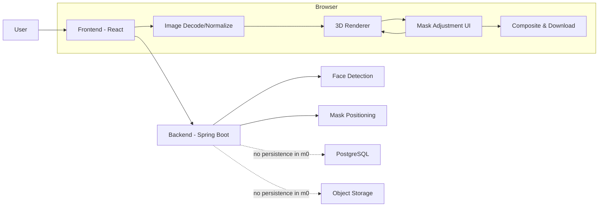
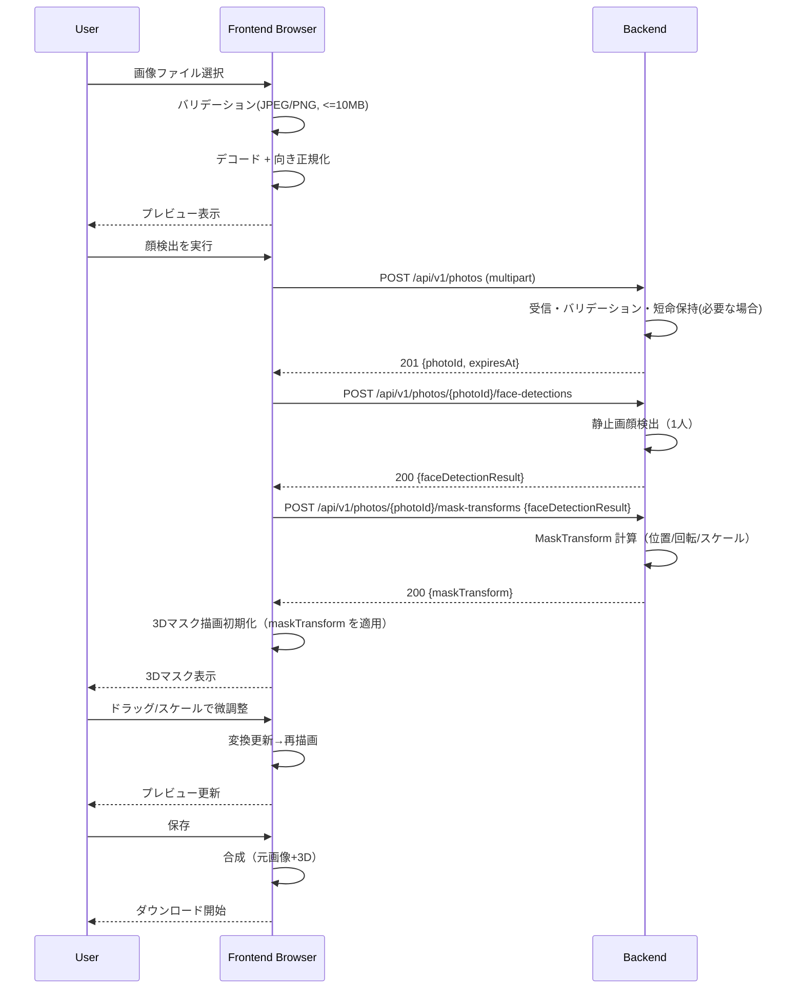

# m0 アーキテクチャ設計（ざっくり）

## 対象機能（m0）と共通概念（短く）

### 対象機能（参照する feature 仕様）

- 写真アップロード（静止画）: `docs/spec/features/01_photo_upload.md`
- 静止画の顔検出（1 人）: `docs/spec/features/02_face_detection_static.md`
- 3D ハトマスク描画（静止画）: `docs/spec/features/03_3d_mask_rendering.md`
- マスク配置（静止画）: `docs/spec/features/04_mask_positioning.md`
- マスク最小調整（静止画）: `docs/spec/features/05_mask_adjustment.md`
- 処理済み画像の保存（静止画）: `docs/spec/features/06_image_save.md`

### 共通概念

- Protected Photo Data（実在写真・入力由来＋派生データ）: 元画像、中間画像、顔ランドマーク、特徴量、base64 等
- 「検出結果（Landmarks）→ 3D 変換（MaskTransform）→ 表示（Render）」の一貫した座標系
- 画像差し替え/再検出時の状態破棄（検出結果・配置・調整値）

---

## 分割案（2〜3 案）

### 案 A: クライアント中心

- 画像選択〜顔検出〜3D 描画〜合成〜ダウンロードまでを **ブラウザ内で完結**
- バックエンドは「将来のための薄い土台（ヘルスチェック等）」に留め、m0 のコア体験には必須にしない

長所:

- Protected Photo Data をサーバへ送らずに済み、方針（非永続/非ログ）を守りやすい
- レイテンシが小さく、TTFR（最初の結果表示）が安定しやすい

短所:

- 端末性能差（特にモバイル）で処理時間/発熱がぶれやすい
- WebGL/ブラウザ差異の調整が必要

### 案 B: サーバ中心（処理パイプラインをサーバに寄せる）

- 画像をバックエンドへアップロードし、検出/初期配置（MaskTransform 計算）をサーバで実行
- 3D 描画（WebGL/Three.js）と最小調整 UI はクライアントで行う（m0 ではサーバで 3D レンダリングしない）

長所:

- 顔検出などの重い処理をサーバに寄せ、端末性能差を吸収しやすい
- フロント/バックの実装フロー（API Contract → Stub → 縦切り）を m0 で検証しやすい

短所（m0 では重い）:

- Protected Photo Data の受信・保持・非ログ・短命 TTL を厳格に運用する必要があり、漏えい面のリスクが増える
- ネットワークやサーバ負荷で待ち時間が増える可能性がある

### 案 C: ハイブリッド（クライアントでコア、サーバは任意の補助）

- 基本は案 A（クライアント完結）
- ただし、将来の拡張や検証のために「任意でサーバへ送る処理（短命・非永続）」の導線を用意できる
  - 例: 画像の受信 → 一時処理（最長 5 分）→ 結果返却（永続化なし）

長所:

- m0 は軽く作れ、必要になった時だけサーバ処理へ寄せられる

短所:

- 2 系統（ローカル/サーバ）の仕様・テストが増えやすい

### 推奨

**決定: 案 B（サーバ中心）を採用**します。

- 今回は「フロントエンドとバックエンドの実装フローを検証する」目的が強く、m0 の時点で API 境界を通す価値が高いため
- m0 のデータ取り扱い方針（Option B: 受信は許容、ただし非永続/短命 TTL/非ログは必須）に沿って、サーバ受信時の運用・実装の要点を設計に織り込むため

トレードオフ:

- セキュリティ/運用上の負担（非ログ・短命 TTL・削除漏れ防止・アクセスログ等）と、ネットワーク遅延が増える
- m0 ではサーバ側 3D レンダリングは行わず、3D 描画はクライアントで継続する（サーバ側 3D は別スパイク扱い）

---

## 目的 / 非目的

### 目的

- 静止画で「写真アップロード → 1 人顔検出 → 3D マスク適用 →（必要なら）最小調整 → 画像保存（ダウンロード）」の一連体験を成立させる
- MediaPipe 等の静止画顔検出と、WebGL/Three.js 等の 3D 描画の実現可能性を確認する
- Protected Photo Data を安全に扱える実装方針（非永続/短命 TTL/非ログ）を、開発時点から守れる構成にする
- フロント/バックの契約（Problem Details 含む）を通し、縦切り開発フローの検証を行う

### 非目的（やらないこと）

- リアルタイム追従（カメラ、60fps など）
- 動画の録画/保存
- 複数人検出/複数マスク
- マスク種類切替、ガチャ、美化、複雑な編集
- 共有（URL 発行、サーバ保存、SNS 連携）
- Protected Photo Data の永続化（DB/Object Storage/キャッシュ/バックアップ含む）

---

## 重要な前提・制約

### データ取り扱い（m0: Option B を前提に、サーバ受信を行う）

- 方針の正本: `docs/dev/policies/data-handling.md`
- Protected Photo Data（元画像・派生データ）は以下を必須
  - 永続化禁止（DB/ストレージ/永続ディスク/CI 成果物/監視添付 など）
  - 短命 TTL（保持が必要でも最短、原則リクエストスコープ）
    - やむを得ずテンポラリを使う場合は最大 5 分以内（推奨 1 分以内）で、例外時も削除
  - 非ログ（ログ/テレメトリ/例外通知に載せない）
    - 入力ファイル名等の識別子もログに載せない
- 検証用の画像は原則「ダミー/合成画像」を使用する（Issue/PR/プロンプト等へ貼らない）

### ブラウザ対応方針

- 最新版の Chrome / Firefox / Safari / Edge を対象（`copilot-instructions.md` の方針に従う）
- WebGL が利用不可の場合は「3D 表示不可」のエラーを提示し、2D（プレビュー等）で継続できる範囲に留める（m0 は過剰なフォールバックをしない）

### 性能/UX 目標（仮）

- Time to first preview（画像選択 → プレビュー表示）: 0.5 秒以内（クライアント側でローカルデコードして即時表示）
- Time to first result（検出開始 →3D マスク初回表示）:
  - PC: 3 秒以内
  - モバイル: 6 秒以内
  - 根拠: ネットワーク往復 + サーバ処理が入るため、案 A より緩めに仮置き。実機/実ネットワークで補正する
- 保存（合成 → ダウンロード開始）: 2 秒以内（大画像は例外あり。進捗表示を優先）

---

## 全体アーキテクチャ（俯瞰）

### 構成要素（m0）

- Frontend（React/TypeScript）
  - 画像選択/バリデーション/デコード/EXIF 正規化
  - 3D 描画（Three.js 等）
  - 最小調整 UI（ドラッグ/スケール）
  - 合成（Canvas 等）→ ダウンロード
- Backend（Spring Boot）
  - 画像受信（multipart）とバリデーション（形式/サイズ）
  - 静止画顔検出（1 人）
  - マスク初期配置計算（Landmarks → MaskTransform）
  - 短命 TTL の一時保持（必要な場合のみ。永続化しない）
- DB（PostgreSQL）
  - m0 では使用しない（Protected Photo Data の永続化禁止のため）
- Object Storage 相当
  - m0 では使用しない（永続化禁止のため）

### 責務境界（Clean Architecture との整合）

- Backend は Clean Architecture に沿い、ドメイン（例: Photo/FaceDetectionResult/MaskTransform）を「境界」として切り出し、永続化や外部技術に依存しない形で保つ
- m0 では DB 永続化しないため、Repository 実装は「短命 TTL の in-memory / tmpfs」などで代替し、ドメイン境界は維持する



---

## 主要なデータフロー

### m0（案 B: サーバ中心）

- アップロード（選択） → サーバで検出/初期配置 → クライアントで 3D 表示 → 調整 → 保存
- 分担:
  - クライアント: 画像プレビュー、3D 描画、最小調整 UI、合成してダウンロード
  - サーバ: 画像受信、静止画顔検出、初期配置計算（MaskTransform）



---

## API 方針（契約の方向性）

案 B（サーバ中心）では、m0 のコアフローを API 経由で成立させます。
厳密な OpenAPI は Task03 で作成しますが、ここでは契約の方向性（粒度/責務/エラー）を定めます。

### 想定エンドポイント（案）

- `GET /api/v1/health`
  - 稼働確認（運用データのみ）
- `POST /api/v1/photos`
  - 画像（multipart）を受信し、短命な `photoId` を返す（永続化しない）
- `POST /api/v1/photos/{photoId}/face-detections`
  - 当該写真に対して顔検出を実行し、検出結果（派生データ）を返す（m0 は同期を基本）
  - m0 では検出結果をサーバ側で保持しない（短命保持・削除の検証は photo の方で行う）
- `POST /api/v1/photos/{photoId}/mask-transforms`
  - 当該写真に対する初期 `maskTransform`（3D マスク配置の推定結果）を生成して返す
  - 入力は `faceDetectionResult` を再送する（サーバが検出結果を保持しない前提）

### リクエスト/レスポンス概略（例）

- `POST /api/v1/photos` → `201 Created`
  - response: `{ "photoId": "uuid", "expiresAt": "..." }`
- `POST /api/v1/photos/{photoId}/face-detections` → `200 OK`
  - response: `{ "result": { "landmarks": [...], "boundingBox": {...}, "confidence": 0.98 } }`
- `POST /api/v1/photos/{photoId}/mask-transforms` → `200 OK`
  - request: `{ "faceDetectionResult": { "landmarks": [...], "boundingBox": {...}, "confidence": 0.98 } }`
  - response: `{ "maskTransform": { "position": {"x": 0, "y": 0}, "rotation": {"yaw": 0, "pitch": 0, "roll": 0}, "scale": 1.0 } }`

※注意: landmarks 等は Protected Photo Data（派生データ）として扱い、ログ/永続化しない。

同期/非同期の扱い（将来の拡張）:

- m0 は同期実行（`201 Created` で即結果返却）を前提とする
- 将来非同期化する場合でもパス設計は維持し、次のように “結果リソース” を GET で取得できる形へ拡張する
  - 例: `POST /api/v1/photos/{photoId}/face-detections` → `202 Accepted` + `{faceDetectionId}`
  - 例: `GET /api/v1/photos/{photoId}/face-detections/{faceDetectionId}` → 状態/結果

### エラーハンドリング（Problem Details 準拠）

- RFC 9457（Problem Details）に準拠し、`type/title/status/detail/instance` を返す
- 例（ファイルサイズ超過）:

```json
{
  "type": "/errors/file-size-exceeded",
  "title": "File Size Exceeded",
  "status": 400,
  "detail": "ファイルサイズは10MB以下にしてください",
  "instance": "/api/v1/photos"
}
```

---

## ドメインの荒いモデル

### Entity / ValueObject 候補

- `Photo`（Entity 相当）
  - id（短命）
  - mimeType, width, height
  - payload はサーバ側で短命保持（in-memory / tmpfs 等）。永続化しない
- `FaceDetectionResult`（ValueObject）
  - landmarks（2D 点群）
  - boundingBox
  - confidence（取得可能なら）
- `MaskAsset`（Entity/ValueObject）
  - モデル/テクスチャの識別子（m0 は 1 種で固定でもよい）
- `MaskTransform`（ValueObject）
  - position(x,y)
  - rotation(yaw,pitch,roll)
  - scale
- `RenderSession`（Entity）
  - photoId, maskAssetId, faceDetectionResultId
  - maskTransform（自動配置 + 手動調整を反映）
- `RenderedImage`（ValueObject）
  - 生成結果（Blob 等）

### Repository Interface 候補（境界として）

- `PhotoRepository`（短命 TTL。in-memory / tmpfs 実装を想定）
- `FaceDetectionResultRepository`（m0 では原則保持しない。非同期化や再取得が必要になった時に導入検討）
- `MaskAssetRepository`（静的アセット参照）
- `RenderedImageRepository`（短命、ダウンロード完了で破棄）

---

## 画像・中間生成物の扱い

### 寿命と保存先（m0: 案 B）

- 元画像（入力）:
  - フロント: ブラウザメモリ（`File`/`Blob`/`ImageBitmap` 等）。`localStorage`/`sessionStorage` には保存しない
  - バック: 受信後に短命保持（原則メモリ。やむを得ずテンポラリなら最大 5 分以内で削除）
- 正規化画像: フロントでメモリのみ（表示と合成に利用）
- ランドマーク等の派生データ:
  - バック: 計算中のみ（必要なら短命 TTL で保持）
  - フロント: 描画中のみ（永続化しない）
- 3D 描画の中間: WebGL/Canvas 内部状態（メモリ）
- 合成結果: `canvas.toBlob()` 等の Blob を生成し、ダウンロード完了後に破棄

### ログに載せないための具体策

- フロント:
  - `console.log` へ base64/landmarks 配列を出さない
  - 例外送信/RUM がある場合も、イベント payload に画像/派生データを含めない
  - `URL.createObjectURL` を使う場合、不要になったら `URL.revokeObjectURL`
- バック（サーバ処理を採用する場合）:
  - リクエスト/レスポンス body のログ出力をしない
  - ログは `requestId/duration/status/errorCategory` 等の運用データに限定
  - テンポラリを使う場合は `try/finally` で必ず削除（例外時も）

---

## 未決事項 / リスク

### 技術リスク

- 静止画の顔検出精度（顔の向き/遮蔽/画質で外れる）
- ランドマーク座標 → 3D の yaw/pitch/roll 推定の近似（「それっぽさ」を満たすか）
- 画像表示領域と Canvas/WebGL の座標一致（リサイズ/アスペクト比維持時の変換）
- WebGL 初期化失敗や Safari での互換性差
- サーバの負荷/タイムアウト/同時実行数による待ち時間
- 受信した Protected Photo Data の削除漏れ、ログ混入（アクセスログ/例外通知含む）
- ネットワーク条件によりアップロードが不安定

### 未決事項

- 顔検出の実行タイミング（手動ボタンか、自動開始か）
- 3D マスクの初期配置に使う代表点（鼻先/目/顔矩形など）と簡易推定の仕様
- 調整 UI に回転（ロール）を入れるか（m0 では任意）
- 合成方法（「見えている見た目」と一致する取得手段の選定）
- 非同期化した場合の API 形（`202` + 結果 GET、タイムアウト、失効後の `410 Gone` 等）

### 早期検証（スパイク）提案

- ダミー画像セットで、次を計測・確認
  - 検出時間（PC/モバイル）と失敗率
  - 初期配置の破綻パターン（正面/斜め/傾き）
  - WebGL/Three.js 初期化と描画の互換性（特に Safari）
  - 合成結果が「画面表示」と一致するか（解像度/色空間/透過）
