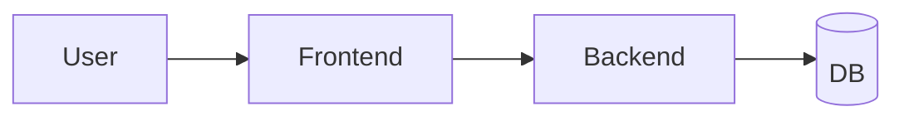
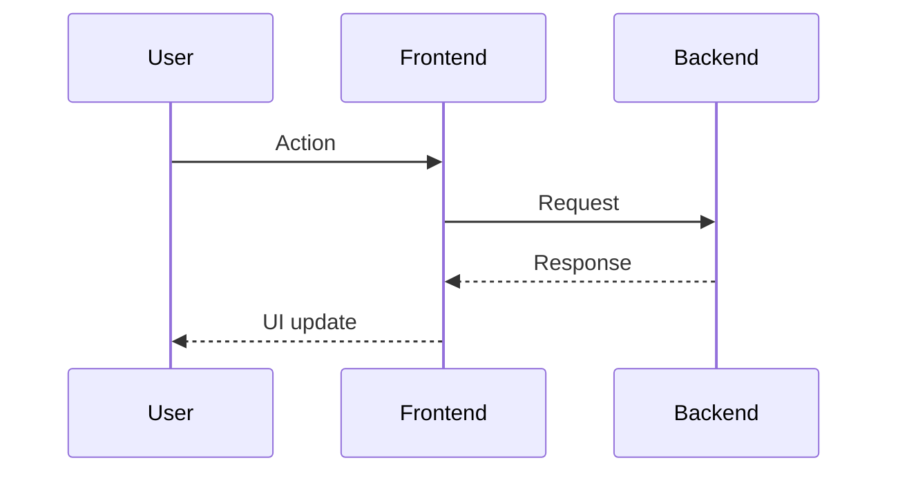

# {MILESTONE_ID} アーキテクチャ設計（ざっくり）

> 使い方: このファイルをコピーして `docs/spec/architecture/{MILESTONE_ID}.md` として作成し、内容を埋める。

## 目的 / 非目的

### 目的

- （記入）

### 非目的

- （記入）

---

## 重要な前提・制約

- データ取り扱い（TTL、非永続化、非ログ、ダミー画像での検証方針 等）
- ブラウザ対応方針
- 性能/UX 目標（仮置き可）

---

## 全体アーキテクチャ（俯瞰）

- 構成要素（Frontend / Backend / DB / 画像処理 / 3D 描画）
- 責務境界（Clean Architecture との整合）

---

## 主要なデータフロー

- 「入力 → 検出/加工 → プレビュー → 調整 → 保存/共有」など、当該マイルストーンの流れ
- クライアント処理 / サーバ処理の分担

---

## API 方針（契約の方向性）

- 想定エンドポイント（概略）
- リクエスト/レスポンスの概略（厳密な OpenAPI は Task03）
- Problem Details によるエラー表現

---

## ドメインの荒いモデル

- Entity / ValueObject 候補
- Repository Interface 候補

---

## 画像・中間生成物の扱い

- 中間データ（base64、ランドマーク等）の寿命
- 保存先（メモリ、短命ストレージ等）
- ログ混入を避ける具体策

---

## 未決事項 / リスク

- 技術リスク
- 未決事項
- 早期検証（スパイク）提案
